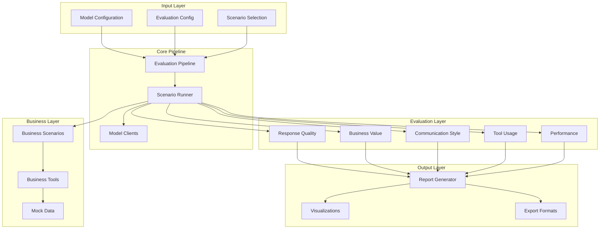

# Architecture Overview

bizCon follows a modular, extensible architecture designed for evaluating LLMs in business contexts. This page provides a comprehensive overview of the framework's design and components.

## 🏗️ High-Level Architecture



## 📁 Directory Structure

```
bizcon/
├── core/               # Core framework components
│   ├── pipeline.py     # Main evaluation orchestrator
│   ├── runner.py       # Scenario execution engine
│   └── utils.py        # Shared utilities
├── models/             # LLM client implementations
│   ├── base.py         # Abstract base class
│   ├── openai.py       # OpenAI integration
│   ├── anthropic.py    # Anthropic integration
│   └── mistral.py      # Mistral integration
├── scenarios/          # Business conversation scenarios
│   ├── base.py         # Scenario base class
│   └── *.py            # Individual scenario implementations
├── tools/              # Business tool simulations
│   ├── base.py         # Tool base class
│   └── *.py            # Individual tool implementations
├── evaluators/         # Evaluation modules
│   ├── base.py         # Evaluator base class
│   └── *.py            # Dimension-specific evaluators
├── visualization/      # Report and dashboard generation
│   ├── dashboard.py    # Interactive dashboards
│   └── report.py       # Static report generation
└── data/              # Mock business data
    ├── products/       # Product catalogs
    ├── knowledge_base/ # FAQ and documentation
    └── pricing/        # Pricing information
```

## 🔧 Core Components

### 1. Evaluation Pipeline (`core/pipeline.py`)

The central orchestrator that manages the entire evaluation process:

```python
class EvaluationPipeline:
    def __init__(self, config_path: str):
        # Load configurations
        # Initialize components
        
    def run(self, scenarios: List[str], output_dir: str):
        # Execute evaluation workflow
        # Coordinate parallel execution
        # Generate reports
```

**Key Responsibilities:**
- Configuration management
- Parallel execution coordination
- Result aggregation
- Report generation triggering

### 2. Scenario Runner (`core/runner.py`)

Executes individual scenarios with specific models:

```python
class ScenarioRunner:
    def run_scenario(self, model: ModelClient, scenario: BusinessScenario):
        # Execute multi-turn conversation
        # Track tool usage
        # Collect metrics
        # Return evaluation data
```

**Features:**
- Conversation state management
- Tool call orchestration
- Metric collection
- Error handling

### 3. Model Clients (`models/`)

Abstract interface for LLM providers:

```python
class ModelClient(ABC):
    @abstractmethod
    def generate_response(self, messages: List, tools: List) -> Dict:
        # Generate single response
        
    @abstractmethod
    def get_token_count(self, text: str) -> int:
        # Count tokens for cost calculation
```

**Provider Implementations:**
- `OpenAIClient`: GPT-4, GPT-3.5 support
- `AnthropicClient`: Claude-3 variants
- `MistralClient`: Mistral AI models

## 🎭 Business Scenarios

Each scenario extends the base class:

```python
class BusinessScenario(ABC):
    def __init__(self):
        self.id = "unique_scenario_id"
        self.name = "Scenario Name"
        self.description = "What this scenario tests"
        self.conversation_flow = []  # Multi-turn structure
        self.available_tools = []    # Required tools
        self.evaluation_criteria = {} # Ground truth
```

**Scenario Types:**
1. **Product Inquiry** - Complex product questions
2. **Technical Support** - Troubleshooting assistance
3. **Contract Negotiation** - Terms and pricing discussions
4. **Appointment Scheduling** - Calendar coordination
5. **Compliance Inquiry** - Regulatory questions
6. **Implementation Planning** - Project scoping
7. **Service Complaints** - Issue resolution
8. **Multi-Department** - Cross-functional coordination

## 🛠️ Business Tools

Tools simulate enterprise systems:

```python
class BusinessTool(ABC):
    @abstractmethod
    def get_definition(self) -> Dict:
        # OpenAI function calling format
        
    @abstractmethod
    def execute(self, **kwargs) -> Dict:
        # Process tool call and return data
```

**Available Tools:**
- **Knowledge Base** - FAQ and documentation search
- **Product Catalog** - Product information retrieval
- **Pricing Calculator** - Dynamic pricing computation
- **Appointment Scheduler** - Calendar management
- **Customer History** - Past interaction lookup
- **Document Retrieval** - Contract/document access
- **Order Management** - Order status and processing
- **Support Ticket** - Ticket creation and tracking

## 📊 Evaluation System

Five dimensions with configurable weights:

```python
class BaseEvaluator(ABC):
    @abstractmethod
    def evaluate(self, response: str, scenario: BusinessScenario) -> float:
        # Return score 0-1
        
    def get_feedback(self, score: float) -> str:
        # Provide scoring explanation
```

**Evaluator Dimensions:**

### 1. Response Quality (25%)
- Factual accuracy
- Completeness of information
- Relevance to query

### 2. Business Value (25%)
- Strategic insights
- Actionable recommendations
- ROI considerations

### 3. Communication Style (20%)
- Professional tone
- Clarity and structure
- Appropriate formality

### 4. Tool Usage (20%)
- Correct tool selection
- Efficient tool use
- Data interpretation

### 5. Performance (10%)
- Response latency
- Token efficiency
- Cost effectiveness

## 🎨 Visualization Layer

### Report Generator
Produces multiple output formats:
- **HTML Reports** - Interactive charts with embedded visualizations
- **CSV Exports** - Raw data for further analysis
- **Markdown Summaries** - Text-based reports

### Interactive Dashboard
Built with Plotly/Dash:
- Real-time filtering
- Comparative analysis
- Drill-down capabilities
- Statistical insights

## 🔄 Execution Flow

1. **Initialization**
   - Load configurations
   - Initialize model clients
   - Prepare scenarios

2. **Evaluation Loop**
   - For each model-scenario pair:
     - Execute conversation
     - Call business tools
     - Collect responses
     - Apply evaluators

3. **Result Processing**
   - Aggregate scores
   - Calculate statistics
   - Generate success rates

4. **Report Generation**
   - Create visualizations
   - Export data files
   - Generate HTML/Markdown

## 🧩 Extension Points

The framework is designed for easy extension:

### Adding New Models
1. Create new client in `models/`
2. Extend `ModelClient` base class
3. Implement required methods

### Adding New Scenarios
1. Create scenario in `scenarios/`
2. Extend `BusinessScenario`
3. Define conversation flow

### Adding New Tools
1. Create tool in `tools/`
2. Extend `BusinessTool`
3. Implement execution logic

### Adding New Evaluators
1. Create evaluator in `evaluators/`
2. Extend `BaseEvaluator`
3. Define scoring logic

## 🔐 Design Principles

1. **Modularity** - Components are loosely coupled
2. **Extensibility** - Easy to add new models/scenarios/tools
3. **Testability** - Mock implementations for testing
4. **Scalability** - Parallel execution support
5. **Reproducibility** - Deterministic evaluation with seeds

---

<p align="center">
  <strong>Ready to explore specific components?</strong><br>
  <a href="Business-Scenarios">View Business Scenarios →</a>
</p>