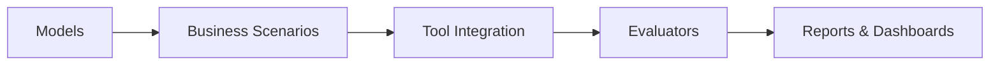

# Welcome to the bizCon Wiki

  
  
  

## 🎯 Business Conversation Evaluation Framework for LLMs

bizCon is a specialized benchmarking framework designed to evaluate how well Large Language Models (LLMs) perform in realistic business scenarios. Unlike general-purpose benchmarks, bizCon focuses on professional communication, business tool integration, and domain-specific knowledge that matters in enterprise environments.

## 🚀 Quick Links

- **[Getting Started](Getting-Started)** - Installation and your first evaluation
- **[Architecture Overview](Architecture)** - Understanding the framework design
- **[Business Scenarios](Business-Scenarios)** - 8 real-world business scenarios
- **[Business Tools](Business-Tools)** - Enterprise tool simulations
- **[Configuration Guide](Configuration)** - Customizing evaluations
- **[API Reference](API-Reference)** - Developer documentation

## 📊 Key Features

### Multi-Model Support
- **OpenAI**: GPT-4, GPT-4-Turbo, GPT-3.5-Turbo
- **Anthropic**: Claude-3-Opus, Claude-3-Sonnet, Claude-3-Haiku
- **Mistral AI**: Large, Medium, Small models

### Comprehensive Evaluation
- **5 Evaluation Dimensions** with configurable weights
- **8 Business Scenarios** covering common enterprise use cases
- **8 Business Tools** simulating real enterprise systems
- **Multi-turn Conversations** testing context retention

### Advanced Analytics
- **Interactive Dashboards** with real-time filtering
- **Statistical Analysis** for meaningful comparisons
- **Multiple Export Formats** (HTML, CSV, Markdown)
- **Performance Metrics** tracking costs and latency

## 🎨 Visual Overview

## 📈 Sample Results

bizCon generates comprehensive evaluation reports showing:
- Overall model performance scores
- Category-specific strengths and weaknesses
- Tool usage effectiveness
- Response time and cost analysis
- Success rates across different scenarios

## 🛠️ Use Cases

1. **Model Selection** - Compare LLMs for business applications
2. **Performance Benchmarking** - Track model improvements over time
3. **Cost Analysis** - Understand token usage and API costs
4. **Tool Integration Testing** - Evaluate function calling capabilities
5. **Business Readiness** - Assess models for enterprise deployment

## 📚 Documentation Structure

### Core Documentation
- **[Getting Started](Getting-Started)** - Installation, quick start, first evaluation
- **[Architecture](Architecture)** - Framework design and components
- **[Configuration](Configuration)** - YAML configuration reference

### Components
- **[Business Scenarios](Business-Scenarios)** - Detailed scenario documentation
- **[Business Tools](Business-Tools)** - Tool capabilities and integration
- **[Evaluation System](Evaluation-System)** - Scoring methodology

### Advanced Topics
- **[Advanced Features](Advanced-Features)** - Dashboards and visualization
- **[Testing Guide](Testing-Guide)** - Framework validation strategies
- **[API Reference](API-Reference)** - Code-level documentation

### Support
- **[FAQ](FAQ)** - Common questions and troubleshooting
- **[Contributing](https://github.com/yourusername/bizcon/blob/main/CONTRIBUTING.md)** - How to contribute

## 🤝 Community

- **Issues**: [Report bugs or request features](https://github.com/yourusername/bizcon/issues)
- **Discussions**: [Join the conversation](https://github.com/yourusername/bizcon/discussions)
- **Contributing**: See our [contribution guidelines](https://github.com/yourusername/bizcon/blob/main/CONTRIBUTING.md)

## 📄 License

bizCon is released under the MIT License. See the [LICENSE](https://github.com/yourusername/bizcon/blob/main/LICENSE) file for details.

---

  <strong>Ready to evaluate LLMs for business use cases?</strong> 
  <a href="Getting-Started">Get Started →</a>

